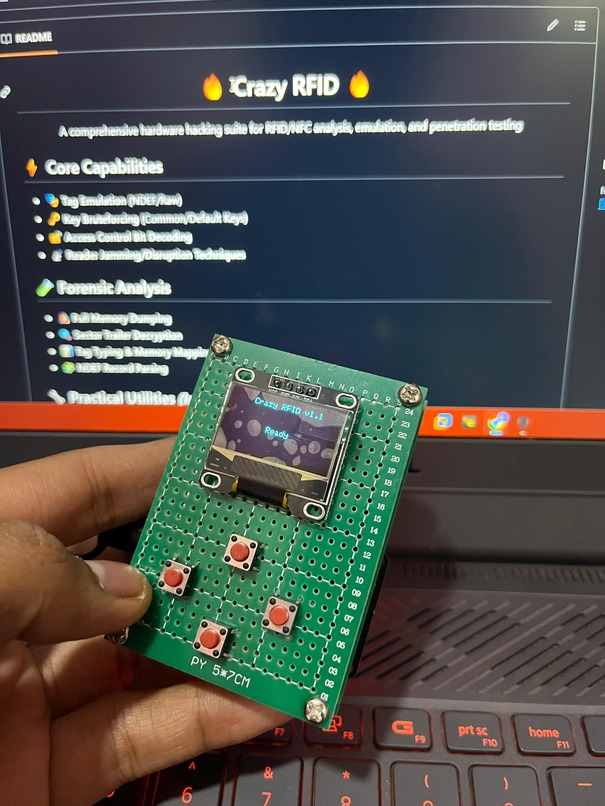

<h1 align="center">🔥 Crazy RFID 🔥</h1>

  

A comprehensive hardware hacking suite for RFID/NFC analysis, emulation, and penetration testing

## ⚡ Core Capabilities
- 🎭 **Tag Emulation** (NDEF/Raw)
- 🗝️ **Key Bruteforcing** (Common/Default Keys)
- 🔓 **Access Control Bit Decoding**
- 📡 **Reader Jamming/Disruption Techniques**

## 🧪 Forensic Analysis
- 🕵️ **Full Memory Dumping**
- 🔍 **Sector Trailer Decryption**
- 📊 **Tag Typing & Memory Mapping**
- 🧩 **NDEF Record Parsing**

## 🔧 Practical Utilities *(In Development)*
- 🧬 **Tag Cloning** (Data + Partial UID)
- 💾 **Data Injection/Erase Operations**
- 📛 **UID Rewriting** (Magic Cards)
- ⚙️ **Custom Key Management**

## 🧱 Component Stack
- **Core Controller:** ESP32 (Dual-core 240MHz)
- **NFC Interface:** PN532 (13.56MHz ISO14443A/MIFARE)
- **Display:** 128x64 OLED (SSD1306)
- **Controls:** 4-button navigation system

---

## ⚠️ Legal & Ethical Notice

**This project is intended for authorized security research and educational purposes only.**  
**Always obtain proper permissions before testing any system.**  
**The developers assume no liability for misuse of this toolkit.**

<h1 align="center">🔥 Coming Soon... 🔥</h1>
